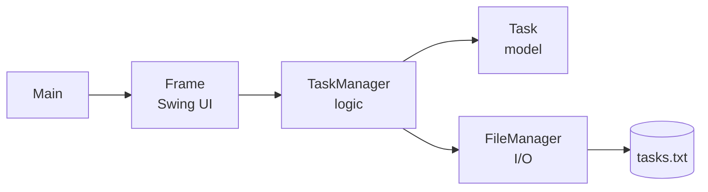

<div align="center">

# ✅ To-Do App

<a href="https://git.io/typing-svg">
  
</a>

<br/><br/>


</div>

---

## ✨ Features

| | Feature | What it does |
|---|---|---|
| ➕ | **Add** | Type a task, hit *Add*, done |
| ✏️ | **Edit** | Pop open a dialog and rewrite any task |
| 🗑️ | **Delete** | Select a task and remove it |
| ✅ | **Mark Complete** | Tasks get a `[✓]` tag once finished |
| 💾 | **Auto-save** | Tasks are written to `tasks.txt` and reloaded on launch |
| 📂 | **Menu panel** | Toggle a side menu with the `MENU` button |

---

## 🚀 Quick Start

```bash
# 1. Clone
git clone https://github.com/<your-username>/<your-repo>.git
cd <your-repo>

# 2. Compile
javac *.java

# 3. Run
java Main
```

> **Requirements:** JDK 8 or newer.

---

## 🖼️ Preview

<div align="center">

<!-- Drop a screenshot or GIF here: -->
<!--  -->

*Screenshot coming soon*

</div>

---

## 🧠 How It Works



| File | Role |
|---|---|
| `Main.java` | Entry point, launches a 600×800 window |
| `Frame.java` | Builds the UI and wires up every button |
| `TaskManager.java` | Add, edit, delete and complete tasks in memory |
| `Task.java` | A single task: title plus done status |
| `FileManager.java` | Reads and writes tasks to `tasks.txt` |

---

## 💾 Save Format

Each task is stored on one line as `title|completed`:

```text
Buy groceries|false
Finish homework|true
```

---

## 🗺️ Roadmap

- [x] Add, edit and delete tasks
- [x] Mark tasks complete
- [x] Save and load from file
- [ ] Persist completed state instantly
- [ ] Keyboard shortcuts (Enter to add)
- [ ] Dark mode
- [ ] Due dates and priorities
- [ ] Layout manager for a resizable window

---

## 🤝 Contributing

Pull requests are welcome. Fork the repo, create a branch, and open a PR.

```bash
git checkout -b feature/my-cool-feature
git commit -m "Add my cool feature"
git push origin feature/my-cool-feature
```

---

<div align="center">

**Built with ☕ and Java Swing**

⭐ Star this repo if it helped you stay productive!


</div>
